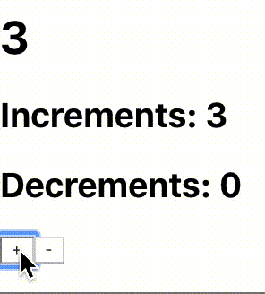

# Most-Basic-React-Redux

This project was bootstrapped with [Create React App](https://github.com/facebook/create-react-app).

## How To Run

In the project directory, using [`npm`](https://nodejs.org/en/), you can run:

### `npm start`

Runs the app in the development mode. 
Open [http://localhost:3000](http://localhost:3000) to view it in the browser.

The page will reload if you make edits. 

## Sample

## Contents

Relevant code is present in [index.js](./src/index.js). The code is divided into 3 sections and illustrates the core patterns of React+Redux.

* Redux: Actions, Creators, Reducers, Store
* React: Two main components
	- __ScoreBoard__ : Stateless and displays main count stored in Redux, accessed through props
	- __Controller__ : Contains local states to track number of increments and decrements. Also, local functions dispatch actions (through props) to change main count in addition to local counters.
* React-Redux: 
	- `mapStateToProps` to get main count in ScoreBoard and `mapDispatchToProps` to dispatch actions from Controller. 
	- The linking of components with Redux is made through `connect` and gives Container components. 
	- These are included in the `App` component, which has access to the store through `Provider`.